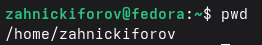
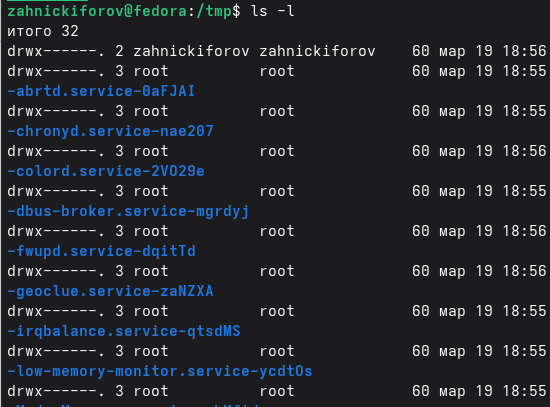
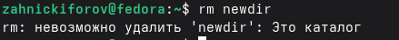
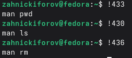

---
## Author
author:
  name: Никифоров Захар Сергеевич
  email: 1032253520@rudn.ru
  affiliation:
    - name: Российский университет дружбы народов
      country: Российская Федерация
      postal-code: 117198
      city: Москва
      address: ул. Миклухо-Маклая, д. 6
## Title
title: Основы интерфейса взаимодействия пользователя с системой Unix на уровне командной строки
subtitle: Лабораторная работа №6
license: CC BY
date: today
date-format: "YYYY-MM-DD" # Example: 2025-09-06
---

# Вводная часть

## Актуальность

- Большинство серверов управляются через командную строку
- Все больше и больше делается на ОС семейства UNIX/Linux
- Командная строка является базовым инструментом

## Объект и предмет исследования

- Объект исследования: текстовый интерфейс взаимодействия с системой
- Предмет исследования: командная строка

## Цели и задачи

Цель: Приобретение практических навыков взаимодействия пользователя с системой по-
средством командной строки. 

Задачи: 
1. Освоить базовые команды командной строки
2. Научится перемещаться в файловой системе
3. Освоить удаление файлов и каталогов
4. Изучить использование справочной системы
5. Ознакомиться с историей команд

## Материалы и методы

- Оборудование: ПК с ОС на базе Linux или ВМ на нем с такой системой
- ПО: Fedora WorkStation
- Методы: Знакомство согласно руководству, опыты, изучение документации.

# Выполнение лабораторной работы

## **Имя домашнего каталога**

Для определения полного имени домашнего каталога используем команду **pwd**

{#fig-001 width=70%}

zahnickiforov --- имя моего домашнего каталога.

## **Просмотр каталогов**

### **ls**
Переходим в каталог **tmp** с помощью команды **cd** и смотрим содержимое с помощью команды **ls**

{#fig-002 width=70%}

Попробуем добавить опции.

---

### **ls -a**

{#fig-003 width=70%}

---

### **ls -l**

{#fig-004 width=70%}

---

### **ls -alF**

{#fig-005 width=70%}

---

## **Проверка наличия cron в /var/spool**

{#fig-006 width=70%}

## **Вывод содержимого домашнего каталога**

{#fig-007 width=70%}

## **Создание и удаление каталогов**

### **Создадим каталог newdir, а в нем morefun** 

{#fig-008 width=70%}

---

### **Создание каталогов memos, letter, misk**

{#fig-009 width=70%}

---

### **Удаление с помощью rm -r**

{#fig-010 width=70%}

---

### **Удаление newdir с помощью rm**

{#fig-011 width=70%}

---

## **Команда man**

### **ls -R**
С помощью команды **man** найдем опцию для команды **ls**, чтобы рекурсивно посмотреть содержимое каталога 

{#fig-012 width=70%}

---

### **ls -lt**

{#fig-014 width=70%}

---

## **Основные опции команд**
    
### **cd**
    
- '~' --- переход в домашний каталог
- ' ' --- переход в родительский каталог
- '/tmp' --- переход в указанный каталог

---

### **pwd**
- не имеет обязательных аргументов и просто показывает, где ты в системе
   
---
   
### **mkdir**
'-p' --- создает вложенные каталоги
'-m' --- задает права доступа

---
    
### **rmdir**
- удаляет пустые каталоги и только пустые. Если есть файлы, то не сработает
    
---
    
### **rm**
'-r' --- рекурсивное удаление каталогов с содержимым
'-i' --- запрос подтверждения перед удалением
'-f' --- принудительное удаление без запросов

---

## **Команда history**

{#fig-015 width=70%}

---

### **Выполнение команд по номеру**

{#fig-016 width=70%}

# Выводы

- Были приобретены практические навыки взаимодействия пользователя с системой посредством командной строки.
