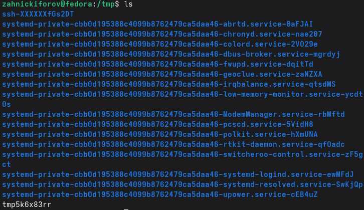
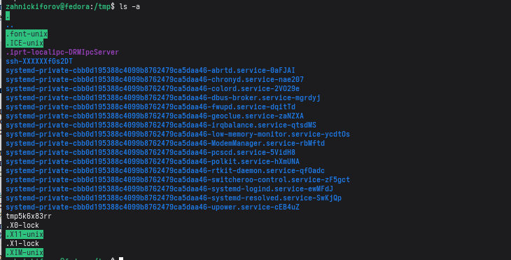
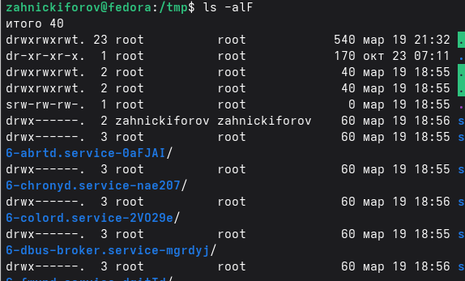
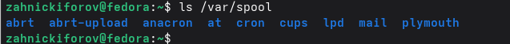
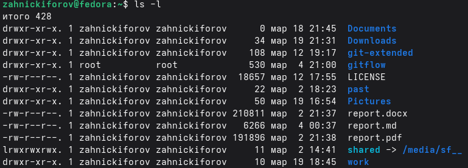
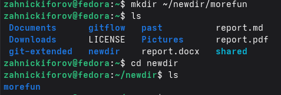
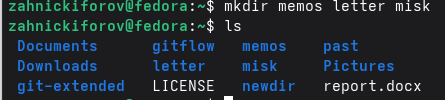
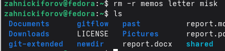
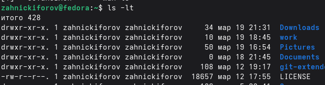
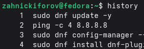

---
author:
  name: Никифоров Захар Сергеевич
  group: НКАбд-05-25
  student-id: 1032253520
title: "Отчет по лабораторной работе №6"
subtitle: "Архитектура компьютера"
license: "CC BY"
---

# **Цель работы**

Приобретение практических навыков взаимодействия пользователя с системой посредством командной строки.

# **Порядок выполнения работы**

## **Имя домашнего каталога**

Для определения полного имени домашнего каталога используем команду **pwd**

{#fig-001 width=70%}

zahnickiforov --- имя моего домашнего каталога.

## **Просмотр каталогов**

Переходим в каталог **tmp** с помощью команды **cd** и смотрим содержимое с помощью команды **ls**

{#fig-002 width=70%}

Попробуем добавить опции. ls -a:

{#fig-003 width=70%}

Вывело еще и скрытые файлы.

ls -l:

{#fig-004 width=70%}

Вывело подробную информацию.

ls -alF:

{#fig-005 width=70%}

Вывело файлы, включая скрытые, с подробной информацией.

Проверим наличие **cron** в **/var/spool**:

{#fig-006 width=70%}

На месте. Теперь выведем содержимое домашнего каталога:

{#fig-007 width=70%}

## **Создание и удаление каталогов**

Создадим каталог **newdir**, а потом в нем **morefun**, используя **mkdir**

{#fig-008 width=70%}

Теперь создадим сразу три каталога: **memos**, **letter**, **misk**

{#fig-009 width=70%}

Удалим же их с помощью **rm -r**.

{#fig-010 width=70%}

Теперь попробуем удалить **newdir** с помощью **rm**

{#fig-011 width=70%}

Не вышло, это каталог, в таком случае надо добавить опцию **-r** для рекурсивного удаления содержимого. Сделаем же.

![Удаление каталога]](image/12.png){#fig-012 width=70%}

## **Команда man**

С помощью команды **man** найдем опцию для команды **ls**, чтобы рекурсивно посмотреть содержимое каталога 

{#fig-013 width=70%}

Это опция **-R**. Теперь же поищем опции, чтобы развернуто посмотреть отсортированное по времени содержание

{#fig-014 width=70%}

Это опция **-lt** сумма **-l** и **-t**.

## **Основные опции команд**
    
cd:
    
'~' --- переход в домашний каталог
' ' --- переход в родительский каталог
'/tmp' --- переход в указанный каталог
    
pwd:
не имеет обязательных аргументов и просто показывает, где ты в системе
    
mkdir:
'-p' --- создает вложенные каталоги
'-m' --- задает права доступа
    
rmdir:
удаляет пустые каталоги и только пустые. Если есть файлы, то не сработает
    
rm:
'-r' --- рекурсивное удаление каталогов с содержимым
'-i' --- запрос подтверждения перед удалением
'-f' --- принудительное удаление без запросов

## **Команда history**

Пропишем команду **history**:

{#fig-015 width=70%}

Мы видим историю команд терминала. Воспроизведем команды по их номеру

{#fig-016 width=70%}

Успешно выполнено.

# **Контрольные вопросы**

1. Это текстовый интерфейс взаимодействия с ОС.

2. Команда **pwd**. Пример:

{#fig-017 width=70%}

3. При помощи команды **ls** и опции **-F**.

4. При помощи команды **ls** и опции **-a**.

5. При помощи команды **rm** и опции **-r** можно удалить все и сразу, отдельно пустые каталоги можно с помощью **rmdir**, а только файлы --- **rm**.

6. С помощью команды **history**.

7. !<номер команды>:s/<старая>/<новая опция>

8. С помощью символа ';', например **cd /tmp; ls**.

9. Это использование символа '\', чтобы система принимала специальные символы как обычные.

10. Команда выводит подробную информацию о типах файлов, правах доступа, владельце, размере, дате изменений и именах файлов.

11. Путь относительно текущего каталога, например, **cd .../folder** --- относительный, **cd /home/user/folder** --- абсолютный.

12. С помощью **man**, пример: **man ls**

13. Клавиша Tab

# **Выводы**

Были приобретены практические навыки взаимодействия пользователя с системой посредством командной строки.

::: {#refs}
:::
